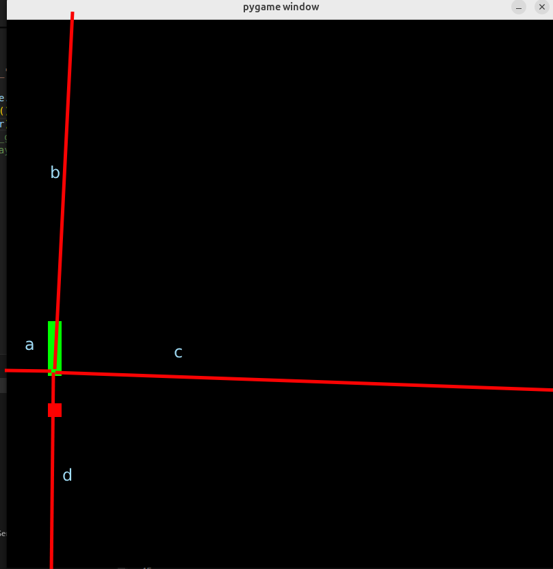
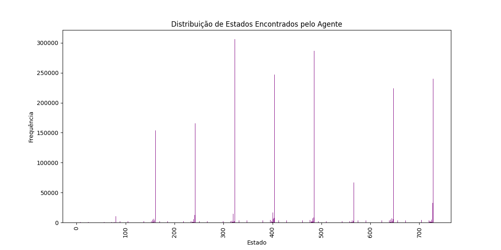

## Esse repositório foi criado para um projeto pessoal de treinamento de agente
# O meu objetivo é estudar de forma que possa me divertir também e decidi treinar um modelinho pra jogar o jogo da cobrinha

# O que foi usado?
# usei numpy, matplotlib(para mostrar dados de treino) e pygame(só pra ficar bonitinho)
# Algoritmo principal é Q - Lerning, basicamente um mapa de estados para ações
# No momento essa foi a única tecnica testada, mas provavelmente vou usar outras, como disse é um repositório de testes e estudos

## Q - Lerning 
# Q(s, a) ← Q(s, a) + α [ r + γ max_a' Q(s', a') - Q(s, a) ]

Onde:
- Q(s, a): O valor Q para o estado `s` e ação `a`, que representa a qualidade de tomar a ação `a` no estado `s`.
- α (alpha): A taxa de aprendizado (learning rate), que controla o quanto o novo valor Q substitui o valor antigo (0 < α ≤ 1).
- r: A recompensa imediata recebida após tomar a ação `a` no estado `s`.
- γ (gamma): O fator de desconto (discount factor), que determina a importância de recompensas futuras em relação à recompensa imediata (0 ≤ γ < 1).
- max_a' Q(s', a'): O máximo valor Q para o próximo estado `s'`, considerando todas as ações possíveis `a'`.

A outra coisa também que é importante explicar, há um epsilon, que indica a probabilidade de ele estando em um estado qualquer tomar uma ação aleatória, no treinamento, apenas para explorar o mapa. Também um epsilon_decay, que é a taxa de decaimento desse mesmo epsilon.
A primeira coisa a fazer para aplicar esse algoritmo para qualquer jogo é entender estados e ações, quantos estados possíveis e quantas ações possíveis
No meu caso o jogo é uma matriz, de tamanho variável mas vou definir como 800x800, comida que para esse primeiro treino é apenas 1 e a cobra, que pode ter um tamanho variável e estar em qualquer lugar. As ações são mais fáceis de entender e são 4(cima, baixo, esquerda e direita).
Foi então modelado assim, para diminuir a quantidade de estados, basicamente os estados são definidor por a, b, c, d, x, y. 

# Explicação
'a' pode assunmir 3 valores, é o valor relativo a distância da cabeça para obstatulo a esquerda, 0 se a ditância for 1, 1 se for menor que 3 ou 2
'b', 'c' e 'd' funcionam da mesma forma, a cauda é contada como obstáculo.
x e y são relacionados a comida
x -> 0 se estiver na mesma linha que a comida, 1 se estiver a cima e 2 se estiver a baixo
y -> 0 se estiver na mesma coluna, 1 direita e 2 esquerda.

# Estados
Um estado é um numero, que representar essas possibilidades, 3⁶ (três para cada variável, a, b, c, d, x, y)

# Treino
Os valores usados nos parâmetros fora:
alpha=0.002, gamma=0.6, times=40000, maxMovies = 15, epsilon=1, epsilon_decay=0.99, min_epsilon=0.1
Contei as vezes que o agente estava em cada ação para poder entender se ele foi treinado para todas ocasiões, a distribuição:

Foi interessante tentar entender quais situações não estavam sendo treinadas, então fiz algumas reformas para deixar mais fácil e não gastar muito tempo para cada treino, gostaria de deixar ainda na casa dos segundos. Então eu fiz com que as primeiras 5 comidas fossem dropadas a 2 quadrados de distância da head(da cobra) e coloquei uma probabilidade maior de a cobra aparecer em um dos 4 cantos, pra ela ser treinada batendo na parede.

